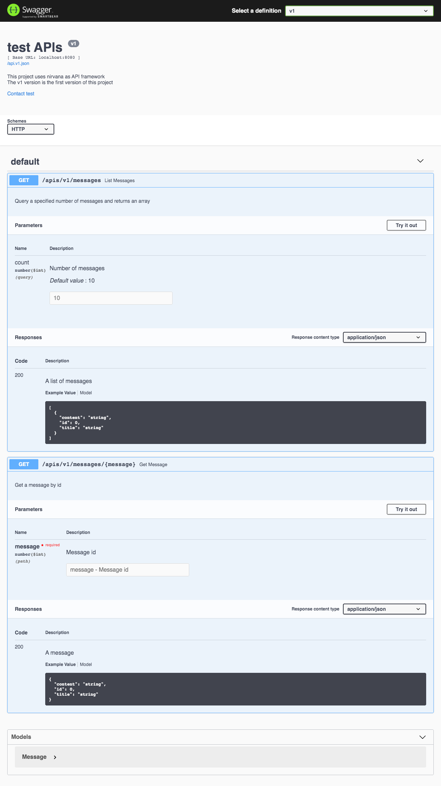

# 生成 API 文档

在完成了 API 的开发工作后，我们需要将 API 公开给用户使用。于是我们需要给 API 的用户提供一个文档，方便用户阅读。Nirvana 提供了一个命令用于从项目中生成文档：
```
$ nirvana api --serve=":8081" ./pkg/api
```
默认情况下，nirvana api 会使用 8080 端口。为了防止端口冲突，可以使用 `--serve` 设置监听的 IP 和端口。

该命令不会退出，并且会输出如下日志（日志时间会有所不同）：
```
INFO  0619-11:57:47.505+08 api.go:162 | Listening on 127.0.0.1:8081. Please open your browser to view api docs
```
这就表示文档生成成功，并且提供了一个 HTTP 服务用于访问这个文档。打开浏览器，访问 `http://127.0.0.1:8081` 即可查看文档。

文档截图如下：


